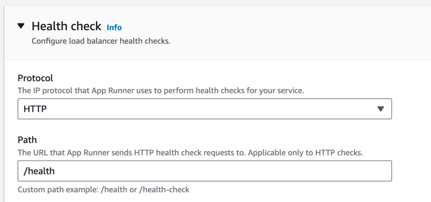

# minimal-dash-app
A minimal Dash app used for App Runner demo.

### `apprunner.yaml`
Configuration file for App Runner. For an overview of App Runner configuration files, see [Setting App Runner service options using a configuration file](https://docs.aws.amazon.com/apprunner/latest/dg/config-file.html).

You can also configure your App Runner service(app) from App Runner console instead of this configuration file.

### HTTP Health Check
Use HTTP Health Check for the App Runner service(app).

### `.devcontainer/devcontainer.json`
Configuration file for [GitHub codespaces](https://github.com/features/codespaces). This is not required to use App Runner.
